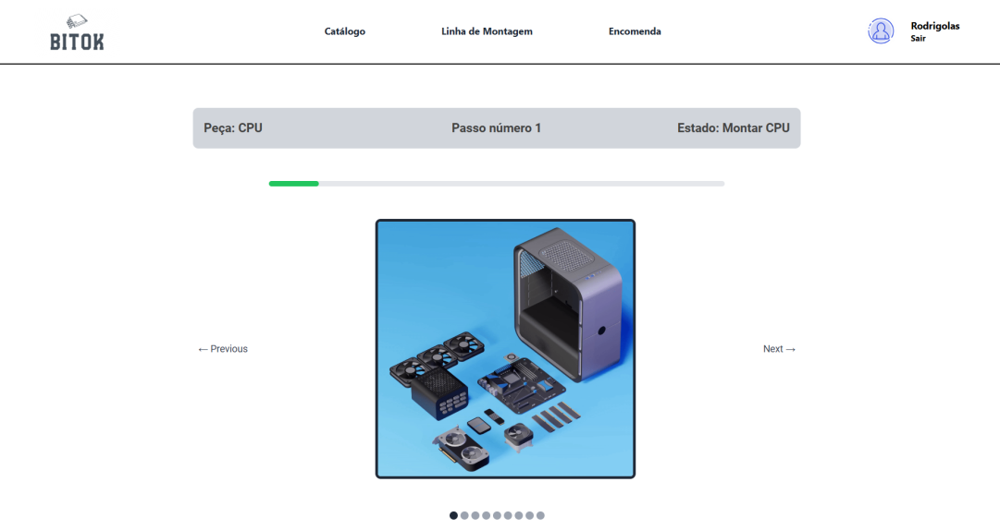

# BitOK - Desktop Assembly

  

## 📌 About the Project

**BitOK** is a management system for desktop assembly lines, developed as part of the **Laboratórios de Informática IV** course in the Software Engineering degree at the **University of Minho**. The system allows tracking the lifecycle of each order, from reception to final delivery, improving operational agility and inventory management.

## 🚀 Technologies Used

- **Frontend:** Blazor (ASP.NET Core), MudBlazor, Tailwind CSS  
- **Backend:** ASP.NET Core, C#  
- **Database:** Microsoft SQL Server  
- **Other Technologies:** SignalR (Real-Time Communication), Dapper (Data Access), Bcrypt (Security)  

## 📖 Features

✔️ User authentication (customers and administrators)  
✔️ Order management and real-time tracking  
✔️ Inventory and product catalog management  
✔️ Monitoring of the assembly line with detailed status updates  
✔️ Intuitive and responsive interface  

## 👥 Team Members

- [André Miranda](https://github.com/RollingJack)  
- [Diogo Outeiro](https://github.com/DiogoOuteiro4)  
- [José Soares](https://github.com/zeeesoares)  
- [Nuno Melo](https://github.com/nunoMelo6)  
- [Rodrigo Lima](https://github.com/RodrimLima19)  

## 🛠️ Installation & Setup

1. Clone this repository:  
   ```sh
   git clone https://github.com/your-repo/bitok-desktop-assembly.git
   cd bitok-desktop-assembly
   ```
   
2. Install dependencies for the backend:
  ```sh
  dotnet restore
  ```

3. Run the backend:
  ```sh
  dotnet run
  ```
4. Access the application at http://localhost:5000

